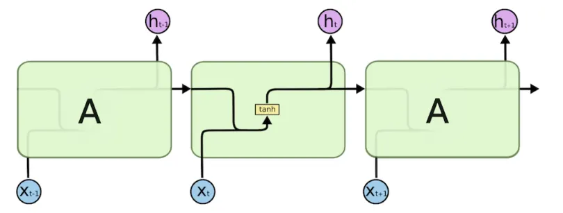

# Les Réseaux de Neurones Récurrents (RNN)

## Définition
Un **Réseau de Neurones Récurrent** (ou **RNN**) est un réseau conçu pour traiter des **séquences**, comme du texte ou des données temporelles. Il garde une **mémoire** via un état caché qui évolue à chaque étape. Les RNN sont utilisés pour l'apprentissage supervisé, non supervisé ou par renforcement, et sont essentiels en Deep Learning, notamment pour la robotique ou le traitement du langage.

## Comment ça marche
Un RNN traite une séquence $( x_1, x_2, \dots, x_T $), où $( T $) est la longueur de la séquence. À chaque étape $( t $), il met à jour un **état caché** $( h_t $) qui dépend de l'entrée actuelle $( x_t $) et de l'état précédent $( h_{t-1} $).

### Propagation avant
Pour chaque étape $( t $) :

1. **Mise à jour de l'état caché** : $h_t = \sigma(W_{xh} \cdot x_t + W_{hh} \cdot h_{t-1} + b_h)$
   
   Où :
   - $( x_t $) : Entrée à l'étape $( t $) (ex. : un mot encodé).
   - $( h_t $) : État caché à l'étape $( t $).
   - $( h_{t-1} $) : État caché à l'étape précédente.
   - $( W_{xh} $) : Matrice de poids pour les connexions entrée-état caché.
   - $( W_{hh} $) : Matrice de poids pour les connexions état caché-état caché (récurrence).
   - $( b_h $) : Biais pour l'état caché.
   - $( \sigma $) : Fonction d'activation (ex. : **tanh** ou **sigmoïde** :
     $\tanh(z) = \frac{e^z - e^{-z}}{e^z + e^{-z}}, \quad \sigma(z)  \frac{1}{1 + e^{-z}}$

2. **Calcul de la sortie** :
   $y_t = \sigma(W_{hy} \cdot h_t + b_y)$

   Où :
   - $( y_t $) : Sortie à l'étape $( t $) (ex. : probabilité pour le mot suivant).
   - $( W_{hy} $) : Matrice de poids pour les connexions état caché-sortie.
   - $( b_y $) : Biais pour la sortie.

## Illustration

## Apprentissage
Les RNN apprennent via la **rétropropagation à travers le temps** (BPTT, Backpropagation Through Time).

### Fonction de perte
Pour une séquence de longueur $( T $), on utilise souvent l'entropie croisée pour une tâche de classification (ex. : prédire le mot suivant) :
$L = \sum_{t=1}^T L_t = \sum_{t=1}^T -\left[ y_{t,\text{vrai}} \cdot \log(y_t) + (1 - y_{t,\text{vrai}}) \cdot \log(1 - y_t) \right]$

### Rétropropagation (BPTT)
On calcule les gradients de la perte $( L $) par rapport aux poids et biais en déroulant la séquence dans le temps.

1. **Gradient de la sortie** :
   $\delta_{y_t} = y_t - y_{t,\text{vrai}}$

2. **Gradient de l'état caché** :
   $\delta_{h_t} = (W_{hy}^T \cdot \delta_{y_t}) \cdot \sigma'(h_t) + (W_{hh}^T \cdot \delta_{h_{t+1}}) \cdot \sigma'(h_t)$

   Où $( \sigma'(h_t) $) est la dérivée de la fonction d'activation (ex. : pour tanh, $( \sigma'(z) = 1 - \tanh^2(z) $)).

3. **Mise à jour des poids et biais** :
   
   $W_{xh} \gets W_{xh} - \eta \sum_{t} \delta_{h_t} \cdot x_t^T$

   $W_{hh} \gets W_{hh} - \eta \sum_{t} \delta_{h_t} \cdot h_{t-1}^T$
   
   $W_{hy} \gets W_{hy} - \eta \sum_{t} \delta_{y_t} \cdot h_t^T$
   
   $b_h \gets b_h - \eta \sum_{t} \delta_{h_t}, \quad b_y \gets b_y - \eta \sum_{t} \delta_{y_t}$
  
   Où $( \eta $) est le taux d'apprentissage (ex. : 0.001).

### Optimisation
On utilise des optimiseurs comme **Adam** ou **SGD** pour ajuster les poids efficacement.

## Exemple : Prédiction de texte
Pour prédire le mot suivant dans une phrase (ex. : "Le chat mange..."), le RNN prend chaque mot comme $( x_t $), met à jour $( h_t $), et prédit $( y_t $) (ex. : "du"). L'état caché $( h_t $) garde une trace du contexte (ex. : "chat" et "mange").

## Limites
- **Gradients instables** : Les RNN souffrent de **gradients qui disparaissent** (trop petits) ou **explosent** (trop grands), rendant l'apprentissage difficile pour les longues séquences.
- **Mémoire limitée** : Les RNN classiques peinent à capturer des dépendances à long terme.
- **Complexité** : BPTT est coûteux en calculs.

### Solutions
- **LSTM** et **GRU** : Résolvent les problèmes de gradients et de mémoire.
- **Transformers** : Plus efficaces pour les longues séquences (voir cours suivant).

## Utilisation
Les RNN sont utilisés pour :
- **Texte** : Génération, traduction.
- **Robotique** : Analyse de capteurs (ex. : séries temporelles de LIDAR).
- **Séries temporelles** : Prédiction de trajectoires ou signaux...

*Ils ont pleins d'autres utilisations mais l'idéal est d'innover !*

## Cours suivant (Réseaux LSTM)
[clique ici](./reseaux-lstm.md)