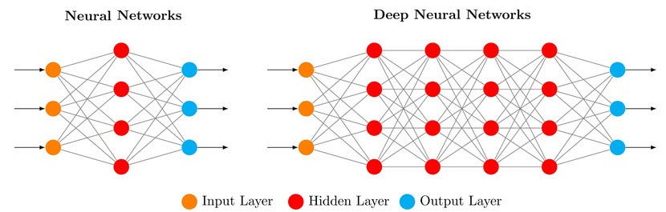

# Les Réseaux de Neurones Profonds (DNN)

## Définition
Un **réseau de neurones profond** (ou **DNN**, Deep Neural Network) est une extension du perceptron multicouche (MLP) avec plusieurs couches cachées. Il est utilisé pour l'apprentissage supervisé, non supervisé ou par renforcement. Les DNN peuvent résoudre des problèmes très complexes, comme la reconnaissance d'images ou la commande de robots, grâce à leur capacité à modéliser des relations non linéaires.

## Comment ça marche
Un DNN est formé de :
- **Couche d'entrée** : Reçoit les données $( x_1, x_2, \dots, x_n $).
- **Couches cachées** : Plusieurs couches (souvent 5, 10 ou plus) de neurones qui traitent les données avec des poids, biais et fonctions d'activation.
- **Couche de sortie** : Donne le résultat (ex. : classe pour classification, valeur pour régression).

Chaque neurone calcule :
1. **Somme pondérée** : $( z = \sum_{i=1}^{n} w_i x_i + b $), où $( w_i $) sont les poids et $( b $) le biais.
2. **Fonction d'activation** : Une fonction non linéaire, comme :
   - **ReLU** : $( f(z) = \max(0, z) $)
   - **Sigmoïde** : $( f(z) = \frac{1}{1 + e^{-z}} $)
   - **Tanh** : $( f(z) = \frac{e^z - e^{-z}}{e^z + e^{-z}} $)

Les nombreuses couches permettent d'extraire des caractéristiques complexes (ex. : bords dans une image, puis formes, puis objets).

## Illustration

## Apprentissage
Les DNN apprennent via la **rétropropagation** et la **descente de gradient** :
1. **Initialisation** : Les poids et biais sont initialisés aléatoirement (souvent avec des méthodes comme Xavier ou He).
2. **Propagation avant** : Pour chaque exemple $( (x, y_{\text{vrai}}) $), on calcule $( y_{\text{prédit}} $) en passant par toutes les couches.
3. **Calcul de l'erreur** : On utilise une fonction de perte, comme l'erreur quadratique pour la régression :
   $
   L = \frac{1}{n} \sum_{i=1}^n (y_{\text{vrai},i} - y_{\text{prédit},i})^2
   $
   ou l'entropie croisée pour la classification :
   $
   L = -\sum_{i=1}^n y_{\text{vrai},i} \log(y_{\text{prédit},i})
   $
4. **Rétropropagation** : On calcule les gradients de $( L $) par rapport aux poids et biais, puis on met à jour :
   $
   w_i \gets w_i - \eta \frac{\partial L}{\partial w_i}
   $
   $
   b \gets b - \eta \frac{\partial L}{\partial b}
   $
   où $( \eta $) est le taux d'apprentissage (ex. : 0.001).
5. **Optimisation** : On utilise des variantes de la descente de gradient, comme **Adam** ou **SGD** (Stochastic Gradient Descent), pour accélérer l'apprentissage.

## Exemple : Classification d'images
Un DNN peut classer des images (ex. : chat ou chien). Les premières couches détectent des bords, les couches intermédiaires des formes, et les dernières couches des objets entiers. Avec assez de données et de couches, le DNN atteint une précision élevée.

## Limites
- **Données** : Les DNN ont besoin de beaucoup de données pour bien apprendre.
- **Calculs** : L'entraînement est coûteux en temps et en ressources (souvent besoin de GPU).
- **Surapprentissage** : Sans régularisation (ex. : dropout, L2), le modèle peut mémoriser les données.
- **Interprétabilité** : Les DNN sont comme des "boîtes noires", difficiles à comprendre.

## Lien avec Deep Learning et Robotique
Les DNN sont au cœur du Deep Learning. Ils sont utilisés pour :
- **Vision par ordinateur** : Détection d'objets, segmentation d'images.
- **Robotique** : Contrôle de robots, planification de trajectoires.
- **Traitement du langage** : Traduction, chatbots.

En robotique, un DNN peut apprendre à naviguer dans un environnement à partir de capteurs (ex. : LIDAR, caméras).

## Cours suivant (Réseaux convolutionnels)
[clique ici](./reseaux-convolutionnels.md)

