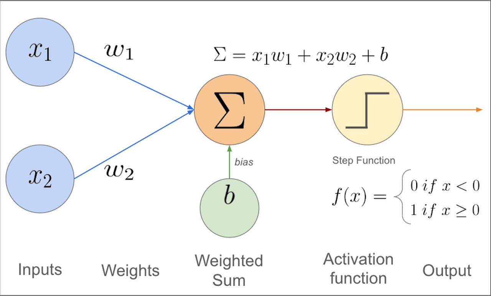

# Le perceptron

## Définition
**Le perceptron**, ou **neurone formel**, est un **neurone artificiel**. Il sert à faire de l'apprentissage supervisé. Inventé en 1957 par Frank Rosenblatt, il peut résoudre des problèmes linéairement séparable, comme l'opération AND.

## Comment ça marche
Un perceptron prend des entrées $( x_1, x_2, \dots, x_n $), leur associe des poids $( w_1, w_2, \dots, w_n $), et calcule une sortie. Voici les étapes :
1. **Somme pondérée** : On calcule ( $z = \sum_{i=1}^{n} w_i x_i + b$ ), où $( b $) est le biais.
2. **Fonction d'activation** : On applique une fonction, souvent la fonction en échelon :
   $f(z) = \begin{cases}  1 & \text{si } z \geq 0 \\ 0 & \text{sinon} \end{cases}$
   La sortie est $( y = f(z) $).

## Illustration


## Apprentissage
Pour apprendre, le perceptron ajuste les poids et le biais :
1. On commence avec des poids aléatoires.
2. Pour chaque exemple $(x, y_{\text{vrai}}) $, on prédit $y_{\text{prédit}}$.
3. Si la prédiction est fausse, on met à jour :
   $w_i \gets w_i + \eta (y_{\text{vrai}} - y_{\text{prédit}}) x_i$

   $b \gets b + \eta (y_{\text{vrai}} - y_{\text{prédit}})$

   où $(\eta$) est le taux d'apprentissage (ex. : 0.1).


## Exemple : AND
Pour l'opération AND avec deux entrées $( x_1, x_2 \in \{0, 1\} $):

| $( x_1 $) | $( x_2 $) | Sortie (AND) |
|-----------|-----------|--------------|
| 0         | 0         | 0            |
| 0         | 1         | 0            |
| 1         | 0         | 0            |
| 1         | 1         | 1            |

Le perceptron trouve des poids (ex. : $( w_1 = 0.5, w_2 = 0.5, b = -0.7 $)) pour résoudre ce problème.

## Limites
Le perceptron ne peut résoudre que des problèmes linéaires. Par exemple, il échoue sur XOR :

| $( x_1 $) | $( x_2 $) | Sortie (XOR) |
|-----------|-----------|--------------|
| 0         | 0         | 0            |
| 0         | 1         | 1            |
| 1         | 0         | 1            |
| 1         | 1         | 0            |

C'est parce que XOR n'est pas linéairement séparable.

## Lien avec Deep Learning
Le perceptron est la base des réseaux de neurones. En combinant plusieurs perceptrons, on peut résoudre des problèmes complexes, comme en Deep Learning ou en robotique.

## Exemple en C
```C
/*
* Copyright (c)
* 2025 NotPunchnox
*/

// Importation de la lib math
#include <stdio.h>
#include <math.h>

// Fonciton de calcul du taux d'erreur ( Log vraisemblance négative )
// formule: -(sortie_attendue * log(prediction) + (1 - sortie_attendue) * log(1 - prediction))
double Loss(double prediction, double sortie_attendue) {
  double result = -(sortie_attendue * log(prediction)) + ((1 - sortie_attendue) * log(1 - prediction));
  return result;
}

// Fonction d'activation ( sigmoïde )
double activation(double y) {
  return 1 / (1 + exp(-y));
}

// Fonction principale
int main() {
  
  // Déclaration des variables

  // exemples de données sur l'opérateur logique AND
  double x[4][2] = {
    {0, 0},
    {0, 1},
    {1, 0},
    {1, 1}
  };
  double yy[4] = {
    0, // 0 AND 0 = 0
    0, // 0 AND 1 = 0
    0, // 1 AND 0 = 0
    1  // 1 AND 1 = 1
  };

  double w[2] = {0.5, -1};
  double b = 1;
  double learning_rate = 0.1;

  // Boucle d'entrainement
  for (int epoch = 0; epoch < 5000; epoch++) {

    // boucle sur les données
    for (int i = 0; i < sizeof(x) / sizeof(x[0]); i++) {
      // Calcul de la sortie du perceptron
      double y = (x[i][0] * w[0]) + (x[i][1] * w[1]) + b;
      double p = activation(y);

      double error = Loss(p, yy[i]);
      
      // Mise à jour des poids et du biais
      for (int j = 0; j < sizeof(w) / sizeof(w)[0]; j++) {
        w[j] = w[j] - learning_rate * (p - yy[i]) * x[i][j];
      }
      
      // Mise à jour du biais
      b = b - learning_rate * (p - yy[i]);

    }

    // Affichage des poids et du biais
    printf("Epoch %d: w1 = %f, w2 = %f, b = %f\n", epoch, w[0], w[1], b);

  }

  // Affichage des poids finaux
  printf("Final weights: w1 = %f, w2 = %f, b = %f\n", w[0], w[1], b);

  // Test du perceptron sur les données d'entrainement
  for (int i = 0; i < sizeof(x) / sizeof(x[0]); i++) {
    double y = (x[i][0] * w[0]) + (x[i][1] * w[1]) + b;
    double p = activation(y);

    printf("Input: (%f, %f) => Prediction: %f, Expected: %f\n", x[i][0], x[i][1], p, yy[i]);
  }

  return 0;
}
```

## Cours suivant (Perceptron multicouches)
[clique ici](./perceptron-multicouches.md)