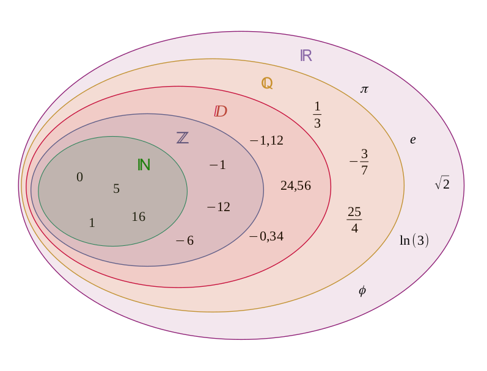

### Partie 1 : Symboles des ensembles numériques

En mathématiques, les ensembles numériques sont utilisés pour décrire les types de nombres dans les prédicats et les quantificateurs. Voici une présentation claire des symboles standards avec leurs significations :

- **ℕ** : **Entiers naturels**. Ce sont les nombres entiers positifs, y compris zéro : {0, 1, 2, 3, …}.  
  *Remarque* : Dans certains contextes, ℕ peut exclure zéro (i.e., {1, 2, 3, …}). Vérifiez la convention utilisée.
- **ℤ** : **Entiers relatifs**. Inclut les nombres entiers positifs, négatifs et zéro : {…, -3, -2, -1, 0, 1, 2, 3, …}.  
  ℕ ⊂ ℤ
- **ℚ** : **Nombres rationnels**. Ce sont les nombres qui peuvent s’écrire sous la forme a/b, où a et b sont des entiers et b ≠ 0. Exemples : 1/2, -3, 0.75.  
  ℤ ⊂ ℚ
- **ℝ** : **Nombres réels**. Inclut tous les nombres sur la droite réelle, c’est-à-dire les nombres rationnels et irrationnels (ex. : √2, π, e).  
  ℚ ⊂ ℝ
- **ℂ** : **Nombres complexes**. Ce sont les nombres de la forme \( a + bi \), où \( a \) et \( b \) sont des nombres réels et \( i \) est l’unité imaginaire (i² = -1).  
  ℝ ⊂ ℂ

### Partie 2 : Utilisation et extensions des ensembles numériques

Ces symboles permettent de spécifier le domaine des variables dans les prédicats ou les quantificateurs. Voici quelques précisions :

- **Utilisation dans les prédicats** :  
  - "pour tout x dans ℝ" signifie « pour tout x appartenant aux nombres réels ».  
  - "il existe n dans ℕ" signifie « il existe un n appartenant aux entiers naturels ».
  
- **Extensions des ensembles** :  
  - **ℚ̅** : **Nombres irrationnels**. Ensemble des nombres réels qui ne sont pas rationnels. Exemples : √2, π.  
  - **ℤ⁺** : **Entiers strictement positifs**. Sous-ensemble de ℤ : {1, 2, 3, …}.  
  - **ℝ⁺** : **Nombres réels strictement positifs**. Ensemble défini par {x ∈ ℝ | x > 0}.  
  - **ℝ⁺₀** : **Nombres réels positifs ou nuls**. Ensemble défini par {x ∈ ℝ | x ≥ 0}.

### Conclusion
Les ensembles numériques (ℕ, ℤ, ℚ, ℝ, ℂ...) offrent une base solide pour définir précisément les domaines dans les raisonnements mathématiques.